<div align="center">

# 📦 ipa-builder

### Genera `.ipa` de iOS sin firmar en la nube — sin Mac, sin pagar 99$/año a Apple.

*[Read in English →](README.md)*

[](.github/workflows/build-ipa.yml)
[](#%EF%B8%8F-cómo-funciona)
[](#-requisitos)
[](#%EF%B8%8F-cómo-funciona)
[](LICENSE)

</div>

---

## El problema

Has creado una app de iOS con Expo o React Native. Quieres probarla en tu
propio iPhone. La respuesta de Apple: cómprate un Mac, o paga **99$/año**
por una cuenta de desarrollador — solo para instalar tu propia app en tu
propio dispositivo.

Sideloadly y AltStore resuelven la mitad del problema (la firma) gratis,
usando tu Apple ID normal. Pero siguen necesitando un `.ipa` ya compilado
para firmarlo, y compilar una app de iOS siempre ha significado Xcode, y
Xcode siempre ha significado un Mac.

**`ipa-builder` elimina el Mac.** Compila tu `.ipa` en los runners macOS
gratuitos de GitHub — sin Xcode local, sin Apple Developer Program, sin
ningún paso de firma de tu parte.

<div align="center">

| Sin ipa-builder | Con ipa-builder |
|---|---|
| 🖥️ Tener o alquilar un Mac | ☁️ Runner macOS de GitHub Actions |
| 💳 99$/año de cuenta Apple Developer | 🆓 Apple ID gratuito (vía Sideloadly/AltStore) |
| 🛠️ Instalar y configurar Xcode | ⚡ `gh workflow run` y esperar ~10-15 min |

</div>

---

## ⚙️ Cómo funciona

Todo el pipeline es un único job `workflow_dispatch`: lo lanzas, hace
checkout de *tu* app en otro repo, la compila sin firmar y te devuelve un
artefacto descargable.

```mermaid
flowchart LR
    A["👤 Tú\ngh workflow run"] --> B["🔀 GitHub Actions\nworkflow_dispatch"]
    B --> C["📥 Checkout del repo objetivo\n(token cross-repo)"]
    C --> D["🍎 Runner macOS\nselecciona Xcode"]
    D --> E["📦 npm install\nexpo prebuild\npod install"]
    E --> F["🔨 xcodebuild\nCODE_SIGNING_ALLOWED=NO"]
    F --> G["🗜️ Empaqueta el .ipa\n(sin firmar)"]
    G --> H["⬆️ Sube el artefacto\nretención 14 días"]
    H --> I["📲 Sideloadly / AltStore\nfirma con tu Apple ID gratis"]
    I --> J["✅ En tu iPhone"]

    style A fill:#1f2937,stroke:#4b5563,color:#fff
    style B fill:#2088FF,stroke:#0969da,color:#fff
    style D fill:#000000,stroke:#4b5563,color:#fff
    style F fill:#147EFB,stroke:#0969da,color:#fff
    style I fill:#3DA639,stroke:#2c7a2c,color:#fff
    style J fill:#1f2937,stroke:#4b5563,color:#fff
```



Cada paso usa el toolchain real — `npx expo prebuild`, CocoaPods,
`xcodebuild` con la firma de código explícitamente desactivada — así que lo
que sale es un artefacto de build sin firmar genuino, no un truco. El job
completo está en un único fichero legible:
[`.github/workflows/build-ipa.yml`](.github/workflows/build-ipa.yml).

---

## 📋 Requisitos

- Una cuenta de GitHub con la [CLI `gh`](https://cli.github.com/) instalada y autenticada (`gh auth login`).
- Un proyecto Expo/React Native en un repo de GitHub (tuyo o al que tengas acceso), con `app.json` configurado (`ios.bundleIdentifier` puesto).
- Haz un fork de este repo (o cópialo) a tu propia cuenta.

## 🔑 Configuración inicial (una sola vez)

El workflow necesita permiso para leer el repo que quieres compilar (aunque
sea privado) usando un token propio — el `GITHUB_TOKEN` por defecto solo
tiene acceso al repo donde vive el workflow.

1. Ve a [github.com/settings/tokens?type=beta](https://github.com/settings/tokens?type=beta) → **Generate new token** (fine-grained).
2. Ponle un nombre, p. ej. `ipa-builder-checkout`.
3. En **Repository access** → **Only select repositories**, marca los repos que quieras poder compilar.
4. En **Permissions → Repository permissions**, pon **Contents: Read-only**. No hace falta nada más.
5. Genera el token y cópialo (solo se muestra una vez).
6. En tu terminal, dentro de tu copia de este repo:

   ```bash
   gh secret set CROSS_REPO_TOKEN --repo TU-USUARIO/ipa-builder
   ```

## 🚀 Uso

```bash
gh workflow run build-ipa.yml --repo TU-USUARIO/ipa-builder \
  -f repo=TU-USUARIO/tu-app \
  -f ref=main \
  -f app_dir=. \
  -f ipa_name=mi-app-unsigned
```

| Input | Significado |
|---|---|
| `repo` | `owner/nombre` del repo con la app que quieres compilar |
| `ref` | Rama, tag o commit (por defecto `main`) |
| `app_dir` | Carpeta con `package.json`/`app.json` (`.` si está en la raíz) |
| `ipa_name` | Nombre que le quieres dar al `.ipa` resultante |

¿Prefieres hacerlo con clics? Ve a la pestaña **Actions** de tu copia de este
repo → **Build unsigned iOS IPA** → **Run workflow**, y rellena los mismos
campos.

Cuando termine (~10-15 min), abre esa ejecución → **Artifacts** → descarga el `.ipa`.

## 💡 Cosas a tener en cuenta

| | |
|---|---|
| **No firmado por Apple** | Intencional — Sideloadly/AltStore lo firman con tu Apple ID gratis al instalarlo |
| **Caduca en 7 días** | Las firmas gratuitas de Apple dejan de funcionar a los 7 días salvo que refresques con Sideloadly/AltServer |
| **Coste del runner macOS** | Cuenta 10× contra tus minutos gratuitos de GitHub Actions |
| **Caducidad del artefacto** | Las descargas caducan a los 14 días (límite de GitHub Actions) |
| **Errores de acceso** | Si `Checkout target project` falla con un error de permisos, el token no tiene acceso a ese repo |

---

## 🤝 Contribuir

Proyecto de código abierto, abierto a contribuciones — reportes de bugs, ideas o pull requests. Abre un issue o PR cuando quieras.

## 📄 Licencia

MIT — úsalo, modifícalo y compártelo libremente. Ver [LICENSE](LICENSE).

---

<div align="center">

Hecho por [**@adro0303**](https://github.com/adro0303) — developer de software/IA cansado de pagarle a Apple para probar sus propias apps.
Más proyectos → [github.com/adro0303](https://github.com/adro0303)

</div>
