<div align="center">

# 📦 ipa-builder

### Build unsigned iOS `.ipa` files in the cloud — no Mac, no $99/year Apple account.

*[Leer en español →](README.es.md)*

[](.github/workflows/build-ipa.yml)
[](#-how-it-works)
[](#-requirements)
[](#-how-it-works)
[](LICENSE)

</div>

---

## The problem

You built an iOS app with Expo or React Native. You want it on your own
iPhone. Apple's answer: buy a Mac, or pay **$99/year** for a developer
account — just to install your own app on your own device.

Sideloadly and AltStore solve the *signing* half of that for free, using
your everyday Apple ID. But they still need a compiled `.ipa` to sign, and
compiling an iOS app has always meant Xcode, which has always meant a Mac.

**`ipa-builder` removes the Mac.** It compiles your `.ipa` on GitHub's free
macOS runners — no local Xcode, no Apple Developer Program, no signing step
on your side at all.

<div align="center">

| Without ipa-builder | With ipa-builder |
|---|---|
| 🖥️ Own or rent a Mac | ☁️ GitHub Actions macOS runner |
| 💳 $99/year Apple Developer account | 🆓 Free Apple ID (via Sideloadly/AltStore) |
| 🛠️ Install & configure Xcode | ⚡ `gh workflow run` and wait ~10-15 min |

</div>

---

## ⚙️ How it works

The whole pipeline is one `workflow_dispatch` job — you trigger it, it checks
out *your* app in a separate repo, builds it unsigned, and hands you back an
artifact.

```mermaid
flowchart LR
    A["👤 You\ngh workflow run"] --> B["🔀 GitHub Actions\nworkflow_dispatch"]
    B --> C["📥 Checkout target repo\n(cross-repo token)"]
    C --> D["🍎 macOS runner\nselect Xcode"]
    D --> E["📦 npm install\nexpo prebuild\npod install"]
    E --> F["🔨 xcodebuild\nCODE_SIGNING_ALLOWED=NO"]
    F --> G["🗜️ Package .ipa\n(unsigned)"]
    G --> H["⬆️ Upload artifact\n14-day retention"]
    H --> I["📲 Sideloadly / AltStore\nsigns with your free Apple ID"]
    I --> J["✅ On your iPhone"]

    style A fill:#1f2937,stroke:#4b5563,color:#fff
    style B fill:#2088FF,stroke:#0969da,color:#fff
    style D fill:#000000,stroke:#4b5563,color:#fff
    style F fill:#147EFB,stroke:#0969da,color:#fff
    style I fill:#3DA639,stroke:#2c7a2c,color:#fff
    style J fill:#1f2937,stroke:#4b5563,color:#fff
```



Every build step runs the real toolchain — `npx expo prebuild`, CocoaPods,
`xcodebuild` with code signing explicitly disabled — so what comes out is a
genuine unsigned build artifact, not a workaround. The full job definition
is one readable file: [`.github/workflows/build-ipa.yml`](.github/workflows/build-ipa.yml).

---

## 📋 Requirements

- A GitHub account with the [`gh` CLI](https://cli.github.com/) installed and authenticated (`gh auth login`).
- An Expo/React Native project in a GitHub repo (yours or one you have access to), with `app.json` configured (`ios.bundleIdentifier` set).
- Fork this repo (or copy it) to your own account.

## 🔑 One-time setup

The workflow needs permission to read the repo you want to build (even if
private) using its own token — the default `GITHUB_TOKEN` only has access to
the repo the workflow itself lives in.

1. Go to [github.com/settings/tokens?type=beta](https://github.com/settings/tokens?type=beta) → **Generate new token** (fine-grained).
2. Name it, e.g. `ipa-builder-checkout`.
3. Under **Repository access** → **Only select repositories**, check the repos you want to build.
4. Under **Permissions → Repository permissions**, set **Contents: Read-only**. Nothing else needed.
5. Generate the token and copy it (shown once).
6. In your terminal, inside your copy of this repo:

   ```bash
   gh secret set CROSS_REPO_TOKEN --repo YOUR-USERNAME/ipa-builder
   ```

## 🚀 Usage

```bash
gh workflow run build-ipa.yml --repo YOUR-USERNAME/ipa-builder \
  -f repo=YOUR-USERNAME/your-app \
  -f ref=main \
  -f app_dir=. \
  -f ipa_name=my-app-unsigned
```

| Input | Meaning |
|---|---|
| `repo` | `owner/name` of the repo containing the app you want to build |
| `ref` | Branch, tag, or commit (defaults to `main`) |
| `app_dir` | Folder with `package.json`/`app.json` (`.` if repo root) |
| `ipa_name` | Name for the resulting `.ipa` |

Prefer clicking? Go to the **Actions** tab of your copy of this repo →
**Build unsigned iOS IPA** → **Run workflow**, and fill in the same fields.

When it finishes (~10-15 min), open that run → **Artifacts** → download the `.ipa`.

## 💡 Good to know

| | |
|---|---|
| **Not signed by Apple** | Intentional — Sideloadly/AltStore sign it with your free Apple ID at install time |
| **7-day expiry** | Free Apple signatures stop working after 7 days unless refreshed via Sideloadly/AltServer |
| **macOS runner cost** | Counts 10× against your GitHub Actions free-tier minutes |
| **Artifact TTL** | Downloads expire after 14 days (GitHub Actions limit) |
| **Access errors** | If `Checkout target project` fails with a permissions error, the token doesn't have access to that repo |

---

## 🤝 Contributing

Open source and open to contributions — bug reports, feature ideas, or pull requests. Open an issue or PR any time.

## 📄 License

MIT — use, modify, and share freely. See [LICENSE](LICENSE).

---

<div align="center">

Built by [**@adro0303**](https://github.com/adro0303) — software/AI developer who got tired of paying Apple to test his own apps.
More projects → [github.com/adro0303](https://github.com/adro0303)

</div>
